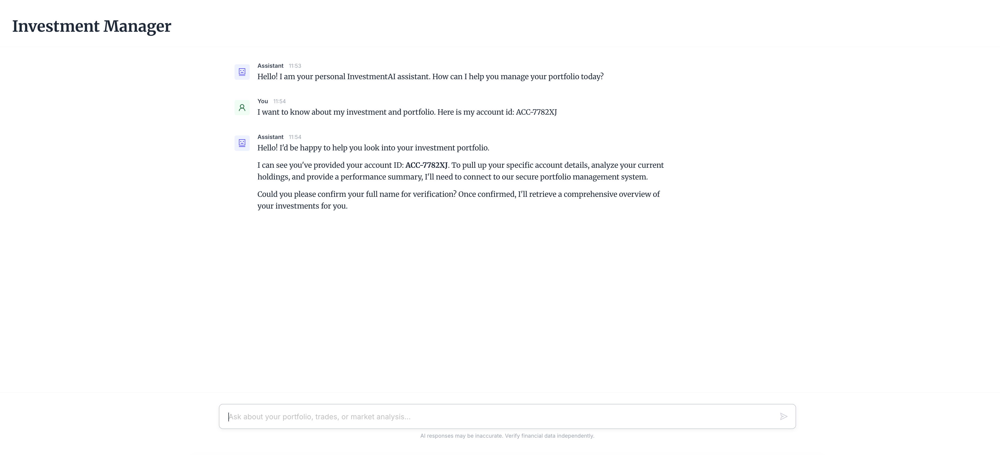

# Embabel Investment Manager

An intelligent investment management system built with Kotlin and the Embabel Agent SDK. This project demonstrates the integration of large language models into a specialized financial domain using autonomous agents.



## Stack

Backend
- Kotlin 2.1
- Spring Boot 3.5
- Embabel Agent SDK
- DeepSeek LLM
- JPA with H2 Database

Frontend
- Vue 3
- TypeScript
- Vite
- Ant Design Vue

## Architecture

The system utilizes the Embabel SDK to orchestrate AI agents that can interact with domain-specific repositories. The backend exposes a REST API that the Vue frontend consumes to provide a seamless natural language interface for portfolio management and investment analysis.

## Setup

Backend
```bash
./gradlew bootRun
```

Frontend
```bash
cd frontend
npm install
npm run dev
```

## Features

- Autonomous investment analysis agents
- Natural language portfolio querying
- Real-time market data simulation
- Responsive chat interface
